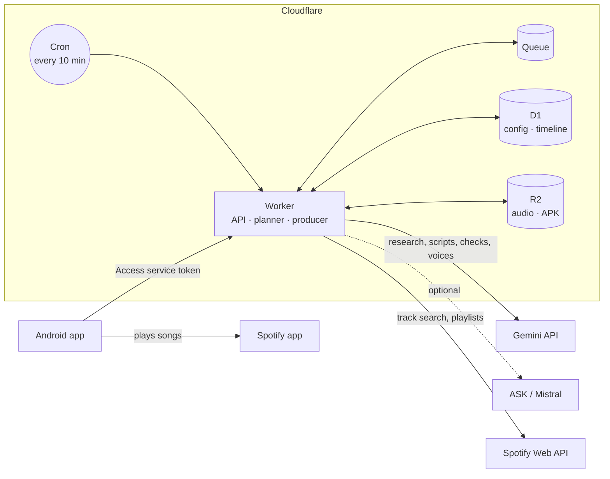

# Personal Radio

A private, AI-hosted radio station. A Cloudflare Worker researches, writes, fact-checks and voices spoken segments ahead of time, mixes in music from Spotify and plans a continuous program around a day plan. You listen, steer the program and set everything up in a native Android app: its «Studio» tab holds every setting, from the voice (with samples) to your own shows, feeds and the editorial team. There is no web interface; the Worker only serves the app.

The station speaks German. Everything runs in your own Cloudflare and Google accounts; nothing is shared with other users.

## Features

**Program**
- Spoken segments from web research (Google Search grounding) or your RSS/Atom feeds, written for the ear, every claim checked against its sources.
- A final desk rewrites each script for radio, connects it to the item before, and a quality jury scores it (★) and sends weak scripts back once.
- Formats: short briefs, two-host dialogs, artist/genre/theme hours with songs, music blocks from your playlists or AI picks.
- Building blocks you add with one tap: morning briefing, weather, headlines, discovery, background, music hours, «new from your artists», «surprise». In the app they are sorted into five colour-coded rubrics (Aktuell, Wissen, Musik, Geschichten, Spezial): «Für dich» suggests four that fit the time of day and your habits, «＋ Einfügen» opens the whole catalog with search and ⭐ favourites.
- Series: a knowledge series or an invented story in five episodes; the next episode joins the program once the one before was heard.
- More formats: «Streitgespräch» (two voices, pro and contra, with sources, neutral summary), «Weltpresse» (how media around the world report on a topic), and «Ortsgeschichten» (the story of a place you pass, while the app is open).
- «Funktionen» in the studio: every automatic feature (live transitions, weekly review, followed topics, concerts, quiz, place stories) switched on or off in one place, with what it costs, and the building blocks the palette shows.
- For the owner: «Nachfragen» – a question about the item that plays, answered from its sources (with a search when needed), voiced and played right after it; «Dranbleiben» – up to five topics checked daily, reported only when something is new; «Merken» – a reading list with the sources, to open or share; «Konzerte in der Nähe» – on Friday afternoon, where your Spotify top artists play soon in Switzerland.
- Wochenrückblick: on Sunday morning a personal look back on the week – the best of what was heard, what mattered in the news, questions to the radio, story choices and new stickers; also a block for any day.
- Mitmachen (above all for a child's station): a «Mitmach-Geschichte» started from picture cards ends every episode with a choice of two ways, chosen in the app; knowledge items on a child's station end with a quiz question (A/B/C); right answers, choices and episodes heard to the end fill a sticker album; «Frag das Radio» sends a question (typed or spoken) that the host answers in the next live transition.
- A day plan with time slots, songs between spoken items, and a surprise level (🎲) that mixes in unexpected items: on this day, word of the day, a music wildcard, …
- Station sound: four ident jingle variants, a news opener, time signal and spoken hour at the full hour, and a soft music bed under short moderations.
- Voices: 30 prebuilt Gemini voices, Google's German voice library, a voice designed from a description, or your own voice cloned in the app (with Google's spoken consent); lively delivery with vocal tags (`<laugh>`, `|mhm|`).
- Live transitions: right before a spoken item airs, the host links it to what just ran, written and voiced on the spot.

**Listening (Android)**
- Background playback with lock screen, Bluetooth, Android Auto and notification controls; offline cache for the next segments.
- Music plays in the Spotify app (App Remote); the app hands over between speech and songs.
- Tabs Hören, Programm, Archiv, Studio – and «Familie» when more people listen (chat, sharing, greetings on air) – with a mini player; the program as one Sendeplan in the rubric colours, with «＋ Einfügen» for everything new.
- On «Hören»: the story's choice or the quiz with big buttons, «Frag das Radio» (with speech input) and the sticker album.
- «Anders» swaps the next item for something different; swipe to remove (with «Rückgängig» for a few seconds), long press to move or play next.
- 👍/👎 with a reason, «Mehr dazu» for a researched follow-up, archive, sleep timer, transcript with sources.
- In-app updates from your own Worker.

**Control**
- Every AI agent (research, writer, editor, jury, fact check, music desk, the music-hour team) is configurable: instructions, freedom, on/off, style presets, trial runs on the last item.
- Quality trend, listener notes from your 👎 reasons, and a daily usage view (calls, tokens, speech characters).

## How it works



1. While you listen, the cron tops up the timeline from your day plan.
2. The queue produces up to two items at a time: research → draft → final edit and jury → fact check → speech synthesis → audio in R2 (on Workers Paid, `SPEECH_MP3=on` stores speech as MP3).
3. The app syncs the timeline, streams speech from the Worker and hands songs to Spotify.

The AI picks songs from its own knowledge; Spotify only resolves them to tracks. Spotify audio, playback data, playlist tracks and track metadata are never sent to an AI provider. Two exceptions apply only if you connect your Spotify listening profile: the names of your top artists guide the song picks, and the «new from your artists» block names each new release (artist and title) in its moderation.

## Tech stack

| Part | Technology |
| --- | --- |
| Backend | Cloudflare Workers (TypeScript), D1, R2, Queues, Cron Triggers, Cloudflare Access |
| AI | Gemini (text, Google Search grounding, TTS); optional ASK (OpenAI-compatible) as independent verifier, optional Mistral voices |
| Android | Kotlin, Jetpack Compose (Material 3), Media3 (ExoPlayer, MediaLibraryService), Spotify App Remote SDK, WorkManager |
| CI/CD | GitHub Actions: tests, Worker deploy with migrations, signed APK |

## Run your own station

This walks you through a complete setup from a fork. Plan about an hour. You need:

- A **GitHub** account (for the fork and the CI that deploys everything).
- A **Cloudflare** account. The free plan works to try it out; the **Workers Paid** plan (USD 5/month) is recommended, because decoding audio can exceed the free CPU time per request.
- A **Gemini API key** from [Google AI Studio](https://aistudio.google.com/apikey) in a project with billing enabled (Google Search grounding and TTS are paid features).
- Optional for music: a **Spotify** account (Premium for playback) and a free [Spotify developer app](https://developer.spotify.com/dashboard).
- An **Android** phone (Android 8 or newer).
- Locally: **Node.js 24**, **git**, and a JDK (for `keytool`, to create the signing key).

### 1. Fork and clone

Fork this repository on GitHub, then:

```sh
git clone https://github.com/<you>/personal-radio.git
cd personal-radio
npm ci
npx wrangler login
```

### 2. Create the Cloudflare resources

```sh
npx wrangler d1 create personal-radio
npx wrangler r2 bucket create personal-radio-audio
npx wrangler queues create personal-radio-production
```

Copy the `database_id` printed by the first command into `wrangler.toml` (replace the existing ID), commit and push:

```sh
git commit -am "Use my D1 database" && git push
```

Keep the names above: the workflows and `wrangler.toml` refer to them.

### 3. Let GitHub deploy to Cloudflare

1. Cloudflare dashboard → **My Profile → API Tokens → Create Token → Custom token** with these account permissions: *Workers Scripts: Edit*, *D1: Edit*, *Workers R2 Storage: Edit*, *Queues: Edit*.
2. In your fork → **Settings → Secrets and variables → Actions**, add:

   | Secret | Value |
   | --- | --- |
   | `CLOUDFLARE_API_TOKEN` | the token from step 1 |
   | `CLOUDFLARE_ACCOUNT_ID` | your account ID (Cloudflare dashboard → Workers & Pages, right column) |

3. Run **Actions → CI → Run workflow** on `main`, or push a commit to `main`. After the checks pass, the Worker `personal-radio-private` is deployed and the database migrations are applied. It refuses all requests until the next step is done.

### 4. Protect the Worker with Cloudflare Access

1. Cloudflare dashboard → **Workers & Pages → personal-radio-private → Settings → Domains & Routes**: enable **Cloudflare Access** for the `workers.dev` address.
2. **Zero Trust → Access → Applications** → the new application → **Policies**: allow only your email address.
3. Note two values: the **team domain** (e.g. `yourteam.cloudflareaccess.com`, shown under *Zero Trust → Settings*) and the application's **Application Audience (AUD) tag** (application → *Overview*).

The Worker checks the Access token itself on every request (signature, issuer, audience and your email), so a misconfigured policy does not open it.

### 5. Set the Worker secrets

Worker → **Settings → Variables and Secrets**, type *Secret* (or `npx wrangler secret put <NAME>`):

| Secret | Required | Value |
| --- | --- | --- |
| `ACCESS_TEAM_DOMAIN` | yes | team domain without `https://` |
| `ACCESS_AUD` | yes | Application Audience tag |
| `ALLOWED_EMAIL` | yes | the email you allowed in Access |
| `GEMINI_API_KEY` | yes | your Gemini API key |
| `ACCESS_SERVICE_TOKEN_ID` | for the app | see step 8 |
| `LISTENERS` | optional | further listeners with their own station, see step 11 |
| `OWNER_NAME` | optional | how the family tab names you (default «Papa»), see step 11 |
| `CF_ACCESS_API_TOKEN` | for invitations | API token with *Access: Service Tokens Edit*, see step 12 |
| `SPOTIFY_CLIENT_SECRET` | for music | see step 6 |
| `ASK_BASE_URL`, `ASK_API_KEY`, `ASK_MODEL` | no | an OpenAI-compatible endpoint; when all three are set it verifies facts as an independent second model |
| `MISTRAL_API_KEY` | no | enables Mistral voices in addition to the Gemini voices |

The Worker runs now. You set up the station in the app (step 9); opening its address in a browser only shows a short note after the Access login.

### 6. Connect Spotify (optional, for music)

1. In the [Spotify developer dashboard](https://developer.spotify.com/dashboard) create an app with the **Web API** and **Android** SDKs.
2. **Redirect URIs** – add both:
   - `https://personal-radio-private.<your-subdomain>.workers.dev/api/spotify/callback` (listening profile)
   - `personal-radio://spotify-callback` (the Android app)
3. **Android package:** `ch.heimberg.radio` with the SHA-1 fingerprint of your signing key (step 7; the Android workflow prints it in the step *Prepare signing key*).
4. **User Management:** while the app is in development mode, add the Spotify account you listen with.
5. On the Worker, add the variable `SPOTIFY_CLIENT_ID` (type *Text*) and the secret `SPOTIFY_CLIENT_SECRET`. Optionally set `SPOTIFY_MARKET` (default `CH`).
6. In the app: **Studio → Musik → Mit Spotify verbinden** to share your top artists and private playlists with the song picks (optional). The login opens in the browser behind your Access login; then return to the app.

### 7. Create the Android signing key

A fixed key lets the app update itself in place. Create it once and keep it outside the repository:

```sh
keytool -genkeypair -v -keystore radio.jks -alias radio -keyalg RSA -keysize 4096 -validity 10000
base64 -w0 radio.jks    # macOS: base64 -i radio.jks
```

Add these repository secrets: `RADIO_KEYSTORE_B64` (the base64 output), `RADIO_KEYSTORE_PASSWORD`, `RADIO_KEY_ALIAS` (`radio`) and `RADIO_KEY_PASSWORD`. Then run **Actions → Android app → Run workflow** on `main`.

### 8. Give the app access

1. **Zero Trust → Access → Service Auth → Create Service Token**, e.g. `personal-radio-app`. Copy the **Client ID** and **Client Secret** (shown only once).
2. In the Worker's Access application add a second policy with action **Service Auth** that includes this token.
3. Set the Worker secret `ACCESS_SERVICE_TOKEN_ID` to the token's Client ID (it ends in `.access`).

### 9. Install the app

1. Open the latest **Actions → Android app** run, download the artifact `personal-radio-android` and install the APK (allow installation from this source when Android asks).
2. On first start enter the Worker address, the Client ID and the Client Secret. The app tests the connection before it saves.
3. In **Studio** tap **Radio einrichten**: the station starts with the default shows in your time zone, and the first program is produced.
4. Tap **Spotify verbinden** once (Spotify app installed and logged in).

From now on every push to `main` deploys the Worker, and every change to the app publishes a signed APK that the app offers as an update.

### 10. Make it yours

In **Studio**: station name, host persona and voice, your location (for weather), interests, music taste and station sound; your own **Sendungen** and **Feeds**; under **Redaktion** every agent and the style presets, under **Qualität** the jury's marks, under **Verbrauch** what a day costs. The day plan and the surprise level are in **Programm → Tagesplan**.

### 11. A station for someone else (optional)

Each further listener gets their own service token and their own station (program, feedback, voice, day plan, Spotify), produced with your provider keys; daily limits count per station.

1. **Zero Trust → Access → Service Auth → Create Service Token**, e.g. `personal-radio-lea`. Copy Client ID and Client Secret.
2. Add the token to the **Service Auth** policy of the Worker's Access application (the same policy as the app's token).
3. Set the Worker secret `LISTENERS` to `<Client ID>=<name>` – for a child `<Client ID>=<name>:kids`. Several listeners are separated by `;`, e.g. `ab12.access=lea:kids; cd34.access=tom`. Then run the deploy workflow again (or save the secret in the dashboard).
4. Install the APK on their phone and enter the Worker address with *their* Client ID and Secret. The app shows «noch nicht eingerichtet»: **Studio → Radio einrichten**. Spotify needs their own account on their phone.

### 12. Invite by link or code (optional)

Instead of step 11 by hand, the app can invite: **Studio → Einladen**, a name and *Familie*, *Kind* or *Gast*, then the share sheet sends a link. The link opens a page with the APK download and a button that joins in the app; the code alone works too. Redeeming it makes a service token for that phone through the Cloudflare API and a station of its own. A code works once and for a week; ten wrong codes per address and hour are allowed, then the page waits. *Gast* gets a station but no family tab, chat or sharing. **Entfernen** revokes the token at once.

One-time setup in Cloudflare:

1. **My Profile → API Tokens → Create Token → Custom**: permission *Account · Access: Service Tokens · Edit* for your account. Set it as the Worker secret `CF_ACCESS_API_TOKEN`, and your account ID (32 hex characters, on the dashboard's overview) as the variable or secret `CF_ACCOUNT_ID`.
2. **Zero Trust → Access → Applications → Add → Self-hosted**: the Worker's hostname with path `join`, one policy with action **Bypass** for *Everyone*. Only the invitation page, the APK for a valid code and the redemption go through it.
3. In the Worker's existing Access application, change the **Service Auth** policy to include **Any Access Service Token**. Access then lets every token of your account through, and the Worker checks each one against the owner's token, `LISTENERS` and the invited listeners (migration `0017_invites.sql`), so unknown tokens are still refused.
4. Playing music through the Spotify app on their phone needs nothing more. Only the **Spotify-Hörprofil** (top artists from the Web API) needs their Spotify account under *User Management* in the Spotify developer app while it is in development mode (up to 25).

**Family.** As soon as `LISTENERS` has an entry, the app gets a tab «Familie» for everyone on the Worker:
- who is there and what they hear right now;
- a chat;
- sharing a produced item into another member's program (a copy with its audio, nothing is produced again);
- «Auch hören», which puts what another member hears into your own program;
- greetings the host reads in the other person's next live transition (and that also appear in the chat).

Everyone can set a profile picture (a tap on one's own circle: from the gallery or the camera; the app sends a 256-px square). New messages show a badge and a notification. A child's station only takes what the owner shares, and a child cannot listen along to other stations. The family sees member names only; set `OWNER_NAME` to change yours.

A `:kids` station follows fixed rules for an 11-year-old in every script, research brief and agent (age-appropriate language, no violence, sexuality, drugs or horror, difficult news only gently), and never plays tracks Spotify marks as explicit. The rules are added in production only, so they cannot be edited away in the studio. Removing the entry from `LISTENERS` (or the token in Access) ends the access; the station's data stays until you delete it.

## Configuration

Optional Worker variables (type *Text*). They live in the dashboard; `wrangler.toml` sets none, so deploys never overwrite them.

| Variable | Default | Purpose |
| --- | --- | --- |
| `DAILY_GENERATIONS` | `24` | productions per UTC day; one hour of listening needs about 15–30 |
| `DAILY_TTS_CHARACTERS` | `12000` | speech characters per UTC day |
| `DAILY_FEED_REQUESTS` | `60` | feed fetches per UTC day |
| `DAILY_LINKERS` | `40` | live transitions per UTC day (separate from productions and the TTS limit) |
| `GEMINI_TEXT_MODEL` | `gemini-3.8-flash` | writing, editing, checks |
| `GEMINI_RESEARCH_MODEL` | `gemini-2.5-flash-lite` | web research (Google Search); without it in your project the text model takes over |
| `GEMINI_TTS_MODEL` | `gemini-3.8-flash-tts` | voices (Interactions API) |
| `GEMINI_TTS_LITE_MODEL` | `gemini-3.8-flash-lite-tts` | live transitions and the hour announcement (prebuilt voices); takes over all speech when Google refuses `GEMINI_TTS_MODEL` for quota (429) |
| `GEMINI_TTS_DAILY_REQUESTS` | `100` | requests a day Google allows `GEMINI_TTS_MODEL` on your tier (Tier 1: 100); only shown in the usage overview |
| `GEMINI_VOICE_A`, `GEMINI_VOICE_B` | `Kore`, `Puck` | the two dialog voices |
| `MISTRAL_TTS_MODEL` | `voxtral-mini-tts-2603` | Mistral voices |
| `SPOTIFY_MARKET` | `CH` | Spotify catalogue |
| `MODEL_PRICES` | built-in estimates | prices for the cost estimate, US dollars per million input/output tokens by part of the model name, e.g. `{"flash-tts": [0.5, 10]}`; first match wins |
| `USD_CHF` | `0.80` | francs per dollar for the cost estimate |

Costs depend on how much you listen. For one listener, D1, R2 and Queues usage is small; the main cost is AI usage billed by Google (and ASK/Mistral if used). The app's **Studio → Verbrauch** shows productions, speech and calls per day and an estimate in francs (today and 30 days; the whole server for the owner), **Studio → Einladen** the same per listener; the provider's bill is what counts. The daily limits above cap spending.

**Monthly budgets.** In **Studio → Verbrauch** the owner sets a budget in francs for all stations together, in **Studio → Einladen** one for their own station and for each listener. They count from the first of the month (UTC) against the estimate above. At 80 % the owner gets a warning (and a listener with a budget of their own sees it too); once a budget is used up, the station (or every station, for the overall budget) makes at most 4 productions a day until the month ends or the budget is raised. Budgets live in D1 (migration `0021_budgets.sql`).

**Warnings.** The owner's phone gets a notification when a provider fails five times within 30 minutes (quota refusals are named as such) or when waiting productions have not been picked up for 30 minutes; each at most once a day.

**Health check.** `GET /join/health` answers without a token (it is under the `/join` bypass of step 12) with yes/no for database, migrations, storage, speech key and Access settings: `200` when all hold, else `503`. The deploy calls it after `wrangler deploy` and fails on `503`; it uses the `workers.dev` address from the deploy, or the repository variable `RADIO_URL` (Settings → Secrets and variables → Actions → Variables) when the Worker runs under your own domain. Without the bypass the check only warns.

## Development

```sh
npm ci
npm run check        # TypeScript
npm test             # unit and Worker tests, D1 via node:sqlite
cd android && ./gradlew -p core test   # Android program logic, no SDK needed
```

`npx wrangler dev` runs the Worker locally with a local D1; never point it at production data. The Android app itself needs the Android SDK (`./gradlew :app:assembleRelease`); CI builds it on every change under `android/`.

## Repository layout

```
server/        Worker: planner, producer, providers (Gemini, ASK, Mistral, Spotify), agents
server/routes/ the API by area (program, items, studio, voices, family, listener, Spotify, transitions)
src/domain/    the domain model (config, blocks, agents, features …) the Worker uses
android/       Android app (app/) and its pure-Kotlin logic with tests (core/)
migrations/    D1 schema
tests/         Node tests of the domain and the Worker
public/        static files the Worker serves (the reference voice sample)
docs/          architecture, deployment and Android details
```

More detail: [architecture](docs/architecture.md) · [Cloudflare deployment](docs/cloudflare-deployment.md) · [CI](docs/deployment.md) · [Android app](docs/android.md).

## Privacy and security

- Keys live only in Worker secrets and GitHub Actions secrets; never commit keys, `radio.jks`, exports or generated audio.
- The Worker is closed to everyone but you: Cloudflare Access in front, and the Worker verifies the Access token itself.
- Spotify data stays out of AI prompts (see *How it works*); the listening profile is opt-in and can be disconnected at any time.
- Ortsgeschichten are off by default. When on, the app reads the phone's last known position while it is open; the Worker asks OpenStreetMap (Nominatim) for the place name, and only that name goes to the AI.
- Voices you add (e.g. Mistral) must be authorized for this use. Check the terms of any feed you add.

## License

[MIT](LICENSE). Bundled third-party components keep their own licenses: the Spotify App Remote SDK (Apache 2.0, `android/app/libs/`), the fonts Figtree and Archivo (SIL OFL 1.1) and Phosphor icons (MIT); see `android/app/licenses/`. The app uses Reorderable (Apache 2.0) for drag and drop. The Worker bundles the MP3 encoder `@breezystack/lamejs` (LGPL-3.0, unmodified).
